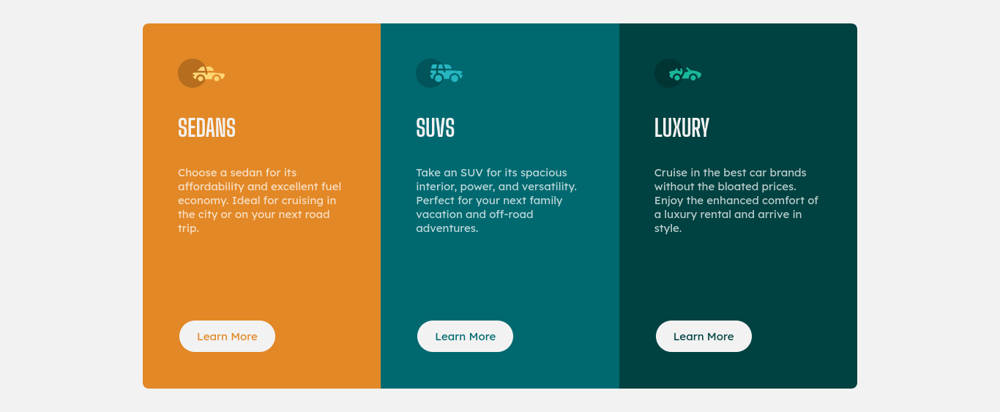

# Frontend Mentor - 3-column preview card component solution

This is a solution to the [3-column preview card component challenge on Frontend Mentor](https://www.frontendmentor.io/challenges/3column-preview-card-component-pH92eAR2-). Frontend Mentor challenges help you improve your coding skills by building realistic projects. 

## Table of contents

- [Overview](#overview)
  - [The challenge](#the-challenge)
  - [Screenshot](#screenshot)
  - [Links](#links)
- [My process](#my-process)
  - [Built with](#built-with)
  - [What I learned](#what-i-learned)
  - [Continued development](#continued-development)
- [Author](#author)

## Overview

### The challenge

Users should be able to:

- View the optimal layout depending on their device's screen size
- See hover states for interactive elements

### Screenshot

### Links

- [Solution URL](https://github.com/steekam/frontendmentor-challenges/tree/main/3-column-preview-card-component)

## My process

### Built with

- Semantic HTML5 markup
- CSS custom properties
- Flexbox
- Mobile-first workflow

### What I learned

This challenge helped me learn how to use flexbox to create containers/cards of the same height regardless of their content. I was also able to use CSS custom properties.

### Continued development

I want to do more challenges that involve layout decisions to use either CSS Grid or FlexBox. I also want to learn how to style box-shadows on components. I want more challenges to help me practise the CSS building blocks.

## Author

- Website - [Kamau Wanyee](https://steekam.me)
- Frontend Mentor - [@steekam](https://www.frontendmentor.io/profile/steekam)
- Twitter - [@mauwanyee](https://www.twitter.com/mauwanyee)

